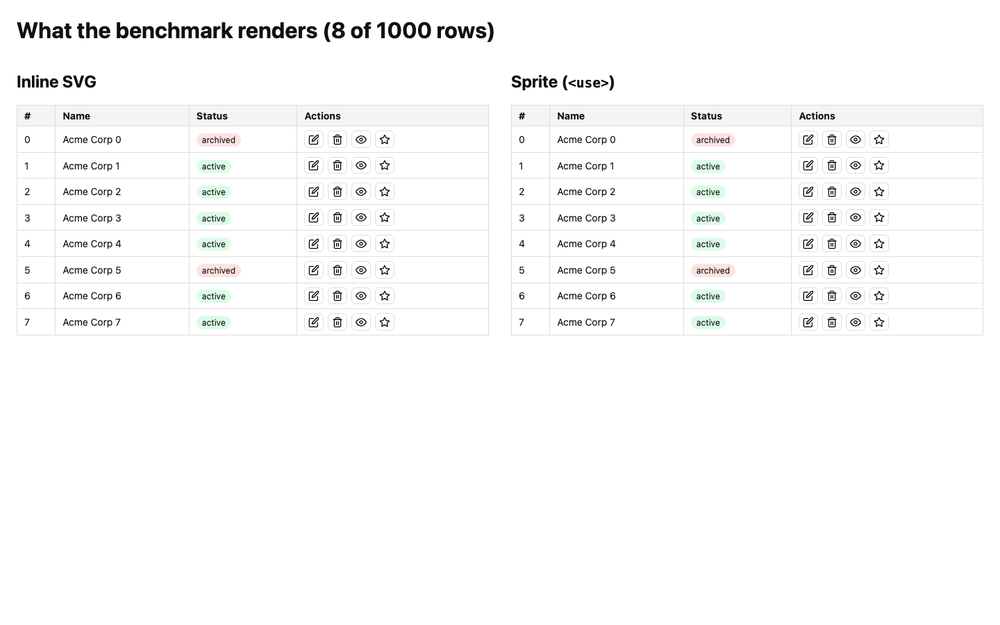
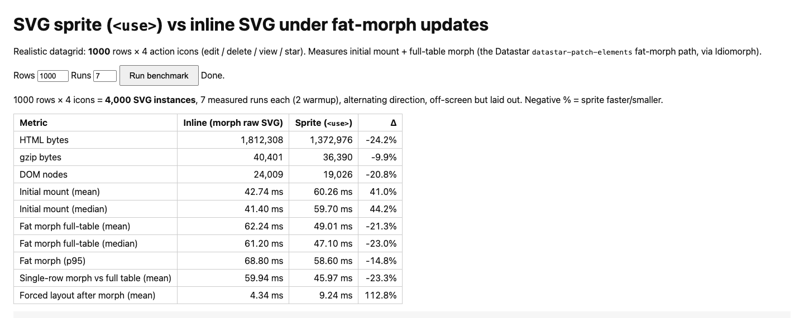

# SVG sprite vs inline SVG under fat-morph updates

Benchmark for the question: when a Datastar backend fat-morphs a region full of
SVG icons, is it worth using an SVG sprite sheet (`<symbol>` + `<use>`) instead
of just morphing raw inline SVG?

**Answer: no — morphing raw inline SVG is fine.** Full analysis in
[ANALYSIS.md](ANALYSIS.md).

## Setup

1000-row datagrid × 4 action icons (edit / delete / view / star) =
**4000 SVG instances**, morphed with Idiomorph (the library Datastar uses for
`datastar-patch-elements`), measured in headless Chrome over 7 runs per
variant, plus DevTools timeline traces and CDP metrics.



## Results (1000 rows)

| Metric | Inline SVG | Sprite (`<use>`) |
|---|---|---|
| HTML bytes | 1,812,308 | 1,372,976 (−24%) |
| gzip (level 6) | 40,401 | 36,390 (~4 KB gap) |
| **brotli q11 / q4** | 14,431 / 16,225 | 14,080 / 15,739 (**~0.4 KB gap**) |
| DOM nodes | 24,009 | 19,026 (−21%) |
| Initial mount | ~41 ms | ~55 ms (+34%) |
| Fat morph (parse + diff) | ~61 ms | ~50 ms (−17%) |
| Layout after morph | ~4 ms | ~9 ms (~2.2×) |
| **End-to-end per update** | **~65 ms** | **~59 ms (wash)** |

Why it's a wash: `<use>` shadow trees skip the JS tree-diff but must all be
style-resolved at layout time (`recalcStyle` 10→17 ms, plus an
`UpdateLayoutTree` pass inline doesn't pay). Brotli's larger window dedupes
repeated SVG so well the wire advantage is ~0.4 KB. Verified adversarially:
harness assertions, reversed run order (63.7 vs 63.7 ms), gzip cross-checked
against Node `zlib` — see [ANALYSIS.md](ANALYSIS.md).

Sprites still win for **static, rarely-morphed** regions (zero re-diff cost,
smaller DOM). They cost you `href`/`xlink:href` legacy quirks, CSP/`file://`
edge cases, and no page-CSS styling inside `<use>` shadow DOM.



## Run it

```sh
npm install              # puppeteer-core, drives local Chrome
npm run bench            # full benchmark -> results.json + trace-*.json
npm run bench:reverse    # adversarial: sprite-first ordering
npm run mem              # heap-after-mount check
npm run compress         # raw + gzip + brotli sizes -> payload-*.html
```

Or open `index.html` in a browser (`?rows=1000&runs=7&autorun=1`).
Open `trace-*.json` in `chrome://tracing` or DevTools → Performance.

## Files

- `index.html` — interactive benchmark harness (Idiomorph via CDN)
- `run-headless.mjs` — headless driver: timings, CDP metrics, traces, assertions
- `ANALYSIS.md` — full writeup with methodology, traces, and verification
- `results.json` — latest run's machine-readable results
- `mem.mjs`, `compress.mjs` — heap and compression supplements
